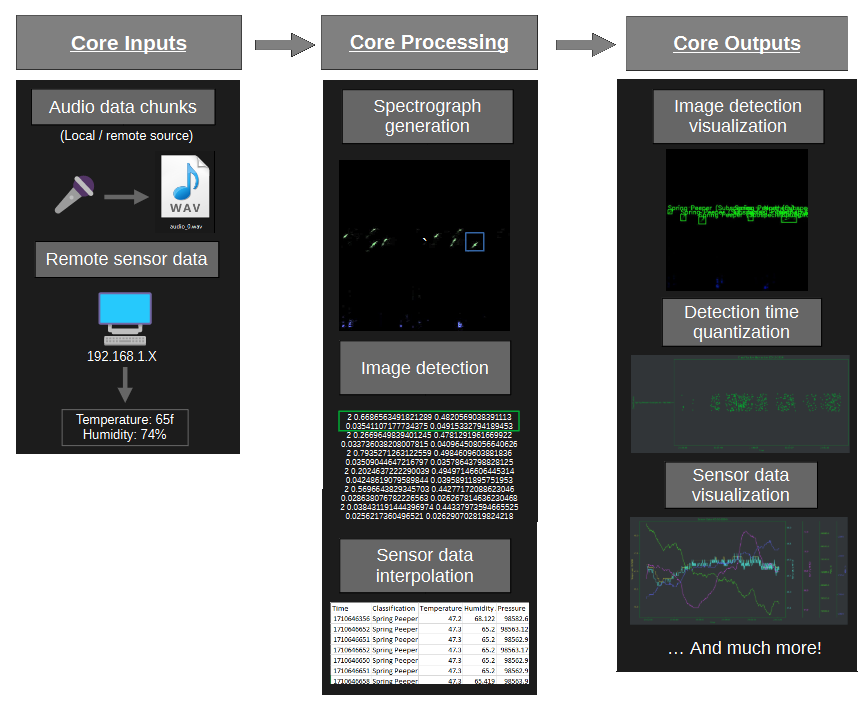

# Introduction
Spectra is a data analytics software that leverages the usage of artificial intelligence to identify the sound of multiple different classes, all at once. Spectra manages the recording of audio and sensor data, detects multiple classes, generates data graphs, and more!  
Spectra supports remote environmental sensors such as: temperature, humidity, wind speed, light sensors and pretty much anything else that is quantifiable.  
Running on a cutting edge, [yolov8](https://github.com/ultralytics/ultralytics) based backend, this software can perform analysis quickly and efficiently.  
The associated repositories [Spectra-Core](https://github.com/ethanstockbridge/Spectra-Core) and [Spectra-UI](https://github.com/ethanstockbridge/Spectra-UI) framework work together, which allows users to easily access the user interface on any modern browser.

# Dataflow

The inputs are collected by using the [Spectra-UI](https://github.com/ethanstockbridge/Spectra-UI) webapp, which consists of a configurable length audio buffer. Additionally, remote sensor stations can be set up for the server to collect data such as temperature and humidity.  
From there, the core app processes the incoming data, converts it to a spectrogram and runs image detection on it. In parallel, sensor data is collected and stored for the run.  
After processing, the core app stores the detections to disc, in image form and text form, for easy postprocessing purposes. Sensor data is transformed into easy-to-read graphs that can show trends of detections, and sensor visualization.

  

# Software Requirements:  
* Python 3.7.9: tested & working. (Other versions ***may*** also work, but no guarantee)
* Modules: opencv, numpy, yolo, etc, install with `pip install -r requirements.txt`

# Hardware requirements

- Please note that there are certain hardware requirements that are needed to run the artificial intelligence, such as nvidia cuda. This mostly pertains to yolo and the underlying modules that it uses, so please check out their website for more information  
    - Tested and working on NVIDIA GeForce GTX 1050ti (with cuda v11.7)

# Quickstart

## Installation

1) Install [python 3.7.9](https://www.python.org/downloads/release/python-379/) (recommended version)
2) `pip install -r requirements.txt`
3) Edit the file variables.py and ./Config/default.toml to update the paths and configuration of your project
4) Start with `py start_server.py`

# Training:  

## File & yolo configuration

Begin by cloning this project and creating some of the (missing) following folders below. You will notice that some exist, some don't. The ones that do not exist are for user read/write:

```
- Spectra-Core
    - config
    - ...
    - recorded
        -class1name
            -audio1.wav/mp3/m4a
            -audio2.wav/mp3/m4a
        -class2name
            - ...
        - ...
        -mixed/random (optional)
    - audio (generated for training, same layout as recorded)
    - images (generated for training, same layout as recorded)
    - labeled (same layout as recorded)
    - unlabeled (same layout as recorded)
    - yolo
        -runs (generated by yolo)
        -train
            -images
                -image1.png
                -image2.png
            -labels
                -image1.txt
                -image2.txt
        -val (same as layout train, but with validation set)
        - config.yaml
        - yolov8<x>.pt
```

**Step 1:**  
Gather data in the form of audio files. These can be pre-recorded from a phone, tablet, or PC.  
After your files are ready, arrange the files appropriately as shown above (refer to 'recorded').  
For the 'recorded' folder, this contains only the desired class to make labeling easier. Audio files should also be named the appropriate name, such as "class-location-date" (ex: spring_peeper-location1-04052024) to accurately document them.
These files must then be converted into WAV files with a sample rate of 44100. You can use the script `convert_to_wav.py` in utilities to convert audio files to wav format. This will source audio from the recorded folder and generate the audio folder.  
**Step 2:**  
Run the extract_data.py file. This will perform the algorithms required to turn the audio files into image files, which you will use to label the data. The output of the extraction script will be $PROJ_ROOT_DIR/images/ The format will follow the same as $PROJ_ROOT_DIR/audio/. This procress will take a while...  
  
**Step 3:**  
(Simple method) Label your data using something like [labelimg](https://pypi.org/project/labelImg/), save off the output files to a folder like: $PROJ_ROOT_DIR/yolo/train/images and $PROJ_ROOT_DIR/yolo/train/labels  
  
(Advanced method) An alternative labeling tool you can use is called [anylabeling](https://github.com/vietanhdev/anylabeling), which is what I use. I think that it can offer some easier labeling but you need to postprocess their json labels into txt labels for yolo to train on.
After labeling, I separate my images and labels into /labeled/ and /unlabeled/ for better organization. You must then use the script `/utilities/split_train_val.py` to copy a 70/30 image split (recommended) from the labeled directory into the yolo train and val folders, respectively.
After splitting, you can run the the script `/utilities/anylabeling_json_to_yolo.py` to convert the json labels to txt yolo format to get it ready to train yolo.  
**Step 4:**  
Train yolo:
You should configure your custom config.yaml, I have included mine if you want to use that to train, you must set up the correct paths first though (adding soon). To run yolo you have to first install [yolov8](https://github.com/ultralytics/ultralytics) with python and be able to call `yolo` on the command line, then cd into your yolo folder shown above, and send the command:  
yolo train data=config.yaml
Once downloaded the initial yolo model, you can train offline using this:  
`yolo train model=yolov8n.pt data=config.yaml`  
Additional typical yolo arguments can be added such as `epochs=500`, `lr0=0.001`, etc.

# License  
This project is licensed under the **GNU AFFERO GENERAL PUBLIC LICENSE**.
Please see the LICENSE file for more information  